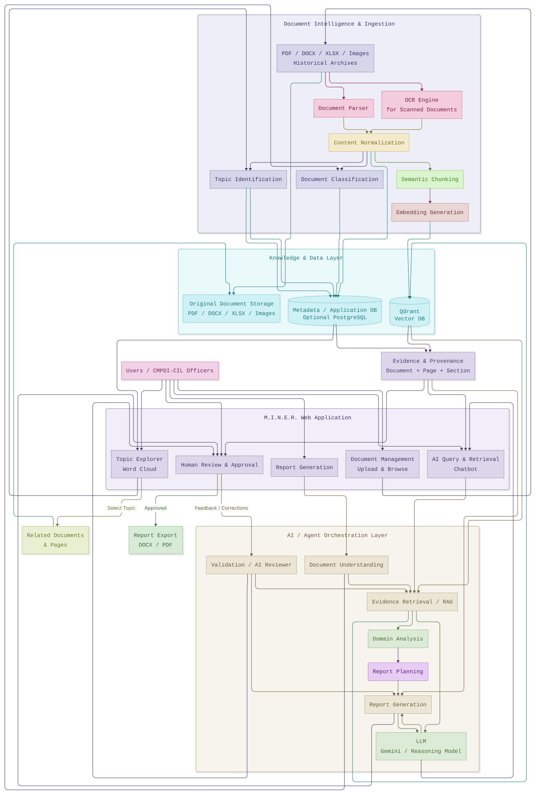

# M.I.N.E.R.
### Mining Intelligence, Knowledge & Evidence Reporter

SIH project: turn legacy scanned mining PDFs (CMPDI/CIL reports) + digital docs + spreadsheets
into cited parliamentary replies, compliance summaries, and analytics.

> Status: ingestion prototype and retrieval foundation implemented. Docs 00–03 remain DRAFT; 04 and 05 describe implemented pipelines.
> Backend: `app/ingestion/` + `app/api/documents.py` + `app/main.py` exist. See `docs/04_INGESTION_PIPELINE.md`.

[](https://todiagram.com/editor?doc=212a515fe30b1decff0ba0b1)



## What exists till now

- `docs/00_PROJECT_CONTEXT.md`, `01_PROBLEM_STATEMENT.md`, `02_REQUIREMENTS.md`, `03_ARCHITECTURE.md` (all DRAFT) + `04_INGESTION_PIPELINE.md` (implemented prototype)
- `docs/_archive/` — old scattered drafts, background only
- `backend/` — uv project (`miner-backend`, Python ≥3.12) with Docling ingestion, FastEmbed/Qdrant semantic retrieval, and PostgreSQL evidence storage; `backend/data/` holds runtime ingestion artifacts (gitignored)
- `AGENTS.md` / `CLAUDE.md` — agent operating protocol
- Notion SIH page — Unified Docs Tracker (mirrors local docs)

## Setup (for a new teammate)

```powershell
cd backend
uv sync
uv run uvicorn app.main:app --reload
# open http://localhost:8000/docs
```

Set `DATABASE_URL`, `QDRANT_URL`, `QDRANT_COLLECTION`, and `EMBEDDING_MODEL` using `.env.example` before indexing. PostgreSQL is the structured source of truth; Qdrant is the rebuildable semantic index. Qdrant can run locally with `docker run --rm -p 6333:6333 qdrant/qdrant`. Docling and embedding model weights download on first use.

## What to do next

1. Read `docs/00_PROJECT_CONTEXT.md` → `01` → `02` → `03` → `04` (in order). PS wins conflicts.
2. Read `docs/05_RAG_PIPELINE.md` for indexing and retrieval commands.
3. Check the Notion SIH tracker for doc progress before creating new docs.
4. Tooling: `uv` only (`uv sync`, `uv run …`). Never commit `backend/data/coal.db`, model caches, or `qdrant_storage/`.

## Key decisions so far (all OPEN, none locked)

- Docling-leaning ingestion (optimal batch/timeout method still under experiment)
- FastAPI monolith + React, PostgreSQL source of truth + new Qdrant collection (`miner_chunks`) as rebuildable mirror
- Facts-first QA, mechanical (code, not LLM) claim validation
- 1 report template in prototype → 2 final (proposal)
